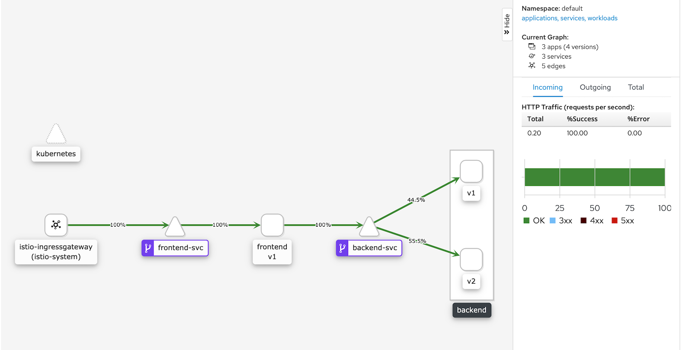

# multiappdemo

Two simple apps, one talks to other. One k8s svc and deployment for each. 

This is a simpler version of Istio's bookinfo app.

## Kubectl apply setup

This is great for testing service-mesh functionality:

```bash
kubectl apply -f https://raw.githubusercontent.com/cbron/multiappdemo/master/multiappdemo.yaml
```

or if you'd like to do each part separately:

```bash
kubectl apply -f https://raw.githubusercontent.com/cbron/multiappdemo/master/backend/deployment.yaml
kubectl apply -f https://raw.githubusercontent.com/cbron/multiappdemo/master/backend/service.yaml
kubectl apply -f https://raw.githubusercontent.com/cbron/multiappdemo/master/frontend/deployment.yaml
kubectl apply -f https://raw.githubusercontent.com/cbron/multiappdemo/master/frontend/service.yaml
```


## Service mesh specifics

**Istio**

```bash
kubectl apply -f https://raw.githubusercontent.com/cbron/multiappdemo/master/istio/istio.yaml
```

This creates a 2nd backend service and sets up istio resources. Use the bash script to call it;
```bash
./istio/callURL.sh
```

Produces the following:




## Local K3d setup

### build

in each dir: 

```bash
docker build -t cbron/multiappdemo-backend:latest .
docker push cbron/multiappdemo-backend:latest
```

```bash
docker build -t cbron/multiappdemo-frontend:latest .
docker push cbron/multiappdemo-frontend:latest
```

### k3d

```bash
k3d cluster create multiappdemo -p "8080:30080@agent[0]" --agents 1
export KUBECONFIG="$(k3d kubeconfig write multiappdemo)"
```

### deploy

```bash
kubectl apply -f backend/service.yaml
kubectl apply -f backend/deployment.yaml
kubectl apply -f frontend/service.yaml
kubectl apply -f frontend/deployment.yaml
```

### curl from host: 

```bash
curl -s 0.0.0.0:8080
```


### Alternatively deploy with helm

```bash
helm3 install multiappdemo ./chart/
# or
helm3 install multiappdemo ./multiappdemo-1.0.0.tgz
```

## Refreshing files with Kustomize

```bash
kubectl kustomize . > multiappdemo.yaml
kubectl kustomize . > chart/templates/multiappdemo.yaml
```
